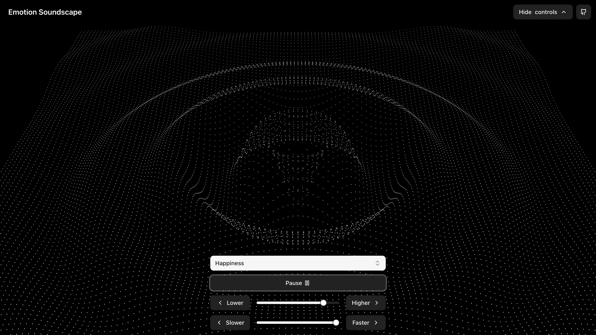

# Emotion Soundscape

A meditative, interactive web experience that turns how you feel into a progressive-house soundscape and a synchronized 3D wavefield.



## Overview

Emotion Soundscape is a single-page Next.js app. You pick an emotion, and the app builds a looping arrangement aimed at a regulation target — for example, anger → calm, sadness → hope, fear → safety. Tone.js drives layered audio (drums, bass, pads, piano stabs, hooks), while React Three Fiber renders a point-cloud wavefield that reacts to each musical layer in real time.

## Features

- **16 emotions** with searchable selection: happiness, sadness, fear, anxious, stress, anger, surprise, disgust, love, guilt, pride, jealousy, hope, embarrassment, relief, gratitude
- **Emotion regulation targets** — each emotion maps to a labeled goal (e.g. “Helping you feel calm”) that shapes the arrangement
- **Progressive house production** — intro → build → drop → breakdown with sidechain, filters, and layered voices
- **Sample-backed audio** — piano sampler plus drum samples, with synthesized 808 kick/clap
- **Audio–visual sync** — kick, snare, hats, bass, keys, pad, and hook each drive the wavefield’s energy and color
- **Emotion color palettes** — per-emotion tints on the wavefield and control accents
- **Live controls** — intensity and tempo sliders, play/pause, collapsible control dock
- **Keyboard shortcut** — Space toggles audio (when focus is not in a text field)
- **Immersive chrome** — header fades while audio plays; hover or focus reveals it again
- **Responsive layout** — full-viewport experience with safe-area padding on mobile

## Technical Stack

| Layer | Tools |
| --- | --- |
| App | Next.js 15 (App Router), React 19, TypeScript |
| Audio | Tone.js, custom arrangement / voice / drum kit builders |
| Visuals | React Three Fiber, Drei, Three.js |
| UI | Tailwind CSS 4, shadcn/ui (Radix), Motion, Lucide |

## Getting Started

### Prerequisites

- Node.js 18.18 or newer (Next.js 15)
- npm

### Installation

1. Clone the repository:

   ```bash
   git clone https://github.com/gavinmgrant/emotion-soundscape.git
   cd emotion-soundscape
   ```

2. Install dependencies:

   ```bash
   npm install
   ```

3. Start the development server (Turbopack):

   ```bash
   npm run dev
   ```

4. Open [http://localhost:3000](http://localhost:3000).

### Scripts

| Command | Description |
| --- | --- |
| `npm run dev` | Development server with Turbopack |
| `npm run build` | Production build |
| `npm start` | Serve the production build |
| `npm run lint` | Run ESLint |

## Usage

1. Choose an emotion from the searchable control dock.
2. Audio starts after samples load; the regulation label appears above the picker.
3. Use play/pause (or Space) to toggle sound.
4. Adjust **Intensity** and **Tempo** to reshape the mix and motion without rebuilding the song.
5. Collapse the dock for a fuller view of the wavefield; the header fades while immersed.

## Project Structure

```
src/
├── app/                 # Next.js App Router (layout, page, styles)
├── components/
│   ├── AppChrome.tsx    # Title + GitHub link
│   ├── EmotionInput.tsx # Emotion picker, transport, sliders
│   ├── SceneCanvas.tsx  # R3F canvas + wavefield
│   ├── VisualResponse.tsx
│   └── ui/              # shadcn/ui primitives
├── configs/
│   └── emotions.ts      # Emotion list, audio configs, regulation targets
├── hooks/
│   └── useEmotionAudio.ts
├── lib/
│   ├── audio/           # Arrangement, voices, drums, samples, profiles
│   └── visual/          # Color palettes, energy → geometry mapping
└── types/
public/
├── samples/             # Drum one-shots (and related assets)
├── screenshot.webp
└── og.webp
```

## Acknowledgments

- [Tone.js](https://tonejs.github.io/) for audio synthesis and sequencing
- [React Three Fiber](https://github.com/pmndrs/react-three-fiber) for 3D rendering
- [Next.js](https://nextjs.org/) for the React framework
- [shadcn/ui](https://ui.shadcn.com/) for accessible UI primitives
